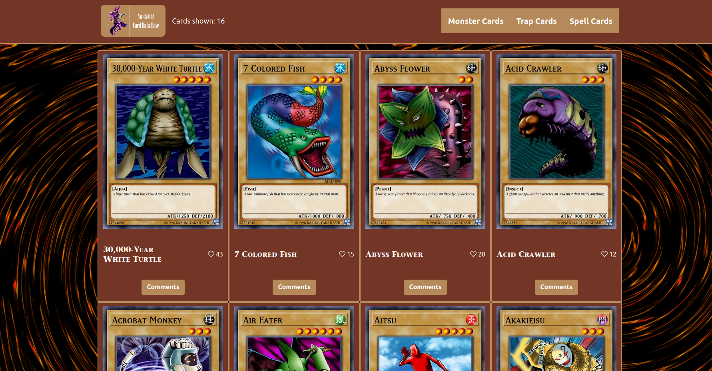

# Yu-Gi-Oh! Card Data Base

> This website hosts a collection of cards from the world wide known game of Yu-Gi-Oh! <br>
You can click on the heart icon to add a like to a specific card. <br>
You can also click on the comment button, and see what other's think of that card and share your own opinion.



## Live Demo

Check out this project live, click [here](https://yothu.github.io/api-capstone-project/dist/index.html)
<hr>

## Built With

- Major languages: JavaScript, HTML, CSS
- Frameworks: Bootstrap 5
- Technologies used: Webpack
<hr>

## Getting Started

To get a local copy up and running follow these simple example steps.

### Setup
Clone this repo into your local device by running the following command on your Terminal:
```
git clone https://github.com/Yothu/api-capstone-project.git
```

That will create a folder with the project inside it. Navigate into it to access the files.

Also remember to run:
```
npm install
```
This will update the dependencies and download necessary files.
<hr>

### Usage
Before you begin testing and experimenting, remember to use the Terminal to create a branch by running:
```
git checkout -b <branch-name>
```

Alternatively, if you use GitFlow, you can run the following command to create a new branch:
```
git flow feature start <branch-name>
```

After that you should be ready to go.
<hr>

### Run tests
Before pushing changes to your branch, I would recommend opening this file:

```
/.github/workflows/linters.yml
```

install and run webhint, stylelint, and eslint

These linters will help you fit your code to this repo's syntax standard.
<hr>

### Deployment
Once you're done with your changes, remember to ```git pull``` before doing ```git push``` this will update 
your local copy of the project if someone else made changes to the repo while you worked on your part.


## Authors


👤 David Vergaray

- GitHub:   [@Yothu](https://github.com/Yothu)
- Twiter:   [@Daivhy](https://twitter.com/Daivhy)
- LinkedIn: [David Vergaray](https://www.linkedin.com/in/david-vergaray-almontes-051a11127/)

👤 **Eduardo Sancho Solano**

- GitHub: [@eduardosancho](https://github.com/eduardosancho)
- Twitter: [@sanchitobless](https://twitter.com/sanchitobless)
- LinkedIn: [Eduardo](https://www.linkedin.com/in/eduardo-sancho-043641181/)
<hr>

## 🤝 Contributing

Contributions, issues, and feature requests are welcome!

Feel free to check the [issues page](../../issues/).

<hr>

## Show your support

Give a ⭐️ if you like this project!
<hr>

## Acknowledgments

- Hat tip to anyone whose code was used
- Inspiration
- etc
<hr>

## 📝 License

This project is [MIT](./MIT.md) licensed.
